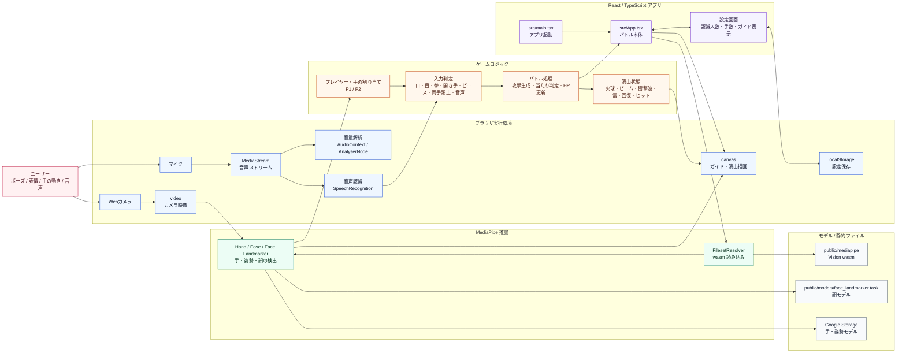
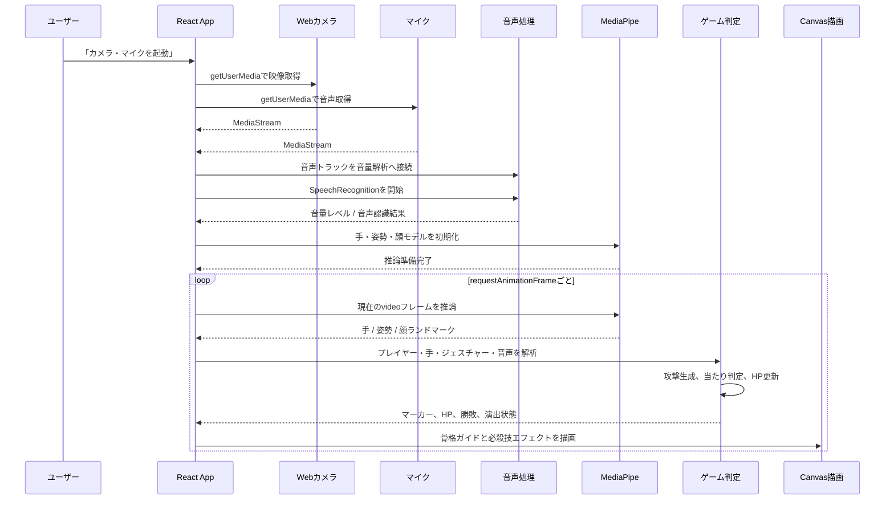

# 必殺技ジェネレーター アーキテクチャ

この資料は、現在の実装をもとにしたアーキテクチャ図と説明です。添付画像は構成の見せ方だけを参考にし、画像内のアプリ名・技術名・イベント名はこのアプリの仕様として扱っていません。

## 全体アーキテクチャ図

この図では、実装上は `src/App.tsx` に集約されている処理を、読みやすさのために「推論」「割り当て」「ジェスチャー判定」「バトル処理」「描画」の役割単位へ分けて表現しています。

## 処理フロー

## 主要コンポーネント

| 領域         | 主なファイル                                              | 役割                                                                             |
| ------------ | --------------------------------------------------------- | -------------------------------------------------------------------------------- |
| アプリ起動   | `src/main.tsx`                                            | `App` を React root にマウントするエントリーポイント                             |
| バトル本体   | `src/App.tsx`                                             | カメラ起動、MediaPipe 初期化、認識ループ、ゲーム判定、Canvas 描画、HP 表示を担当 |
| 設定画面     | `src/pages/setting/setting.tsx`                           | 認識人数、認識手数、関節ガイド表示を変更し、`localStorage` に保存                |
| スタイル     | `src/App.css`, `src/index.css`, `src/pages/home/home.css` | バトル画面、カメラ領域、マーカー、設定画面、開始画面などの見た目を定義           |
| 静的アセット | `public/mediapipe`, `public/models`                       | MediaPipe の wasm と顔認識モデルを配信                                           |

## レイヤー構成

| レイヤー       | 内容                                                                                                                                                                   |
| -------------- | ---------------------------------------------------------------------------------------------------------------------------------------------------------------------- |
| 入力           | ユーザーの動きや表情を Web カメラ、音声をマイクで取得します。映像は `video` 要素に、音声は音量解析と音声認識に渡します。                                               |
| 推論           | MediaPipe が `video` の各フレームから、手・姿勢・顔のランドマークを検出します。                                                                                        |
| 音声処理       | `AudioContext` / `AnalyserNode` でマイク音量を解析し、`SpeechRecognition` で音声コマンドを認識します。ブラウザが音声認識に対応しない場合は、映像認識のみで動作します。 |
| ゲームロジック | 検出結果と音声認識結果から P1/P2 と手を割り当て、ジェスチャー、攻撃、回復、当たり判定、勝敗を処理します。                                                              |
| 出力           | `canvas` に骨格ガイドと必殺技演出を重ね、React の UI に HP、状態、勝敗を表示します。                                                                                   |
| 設定           | 設定画面で認識上限やガイド表示を変更し、`localStorage` に保存します。                                                                                                  |

## データの流れ

1. ユーザーが「カメラ・マイクを起動」を押すと、ブラウザから映像と音声の `MediaStream` を取得します。
2. 映像トラックを `video` 要素へ接続し、音声トラックを音量解析と音声認識へ接続します。
3. `FilesetResolver` が `public/mediapipe` の wasm を読み込みます。
4. `HandLandmarker`、`PoseLandmarker`、`FaceLandmarker` が video フレームを解析します。
5. 顔ランドマークからプレイヤー候補を作り、画面上の位置で `player1` / `player2` に割り当てます。
6. 手ランドマークは、顔の中心に近いプレイヤーへ割り当てられます。
7. 口・目・手の形・手の移動・音声コマンドから必殺技や回復を判定します。
8. 攻撃が相手に当たると HP が減り、回復が成立すると自分の HP が増えます。
9. `canvas` に骨格ガイド、プレイヤーマーカー、火球、ビーム、雷、回復、ヒット演出が描画されます。

## 必殺技判定

| 技       | 入力・条件                               | 主な処理                                                     |
| -------- | ---------------------------------------- | ------------------------------------------------------------ |
| 口ビーム | 口が開き、左右の目も開いている           | 顔からビーム方向を計算し、相手の顔領域との線分衝突でダメージ |
| 火球     | 拳を作り、一定以上まっすぐ動かす         | 手の移動方向へ火球を生成し、円同士の衝突でダメージ           |
| 衝撃波   | 両手を開き、手の距離と向きが条件を満たす | 両手の中心から方向を計算し、範囲線分で継続ダメージ           |
| 雷       | 両手を頭上付近で近づけて一定時間維持     | チャージ完了後、相手へ大ダメージと雷エフェクト               |
| 回復     | ピース形状の手を一定時間維持             | チャージ完了後、自分の HP を回復                             |

## 状態管理

`useState` は画面に表示する状態を中心に使われています。代表例は HP、勝敗、カメラ状態、モデル準備状態、検出数、プレイヤーマーカー、設定値です。

`useRef` は毎フレーム更新される内部状態に使われています。代表例は MediaPipe インスタンス、カメラストリーム、アニメーション ID、火球配列、演出配列、攻撃履歴、クールダウン、チャージ開始時刻です。これにより、毎フレームのゲーム処理を React の再描画に過度に依存させずに進めています。

## 外部依存

| 依存                    | 用途                                                   |
| ----------------------- | ------------------------------------------------------ |
| React / React DOM       | UI と状態管理                                          |
| Vite                    | 開発サーバーとビルド                                   |
| TypeScript              | 型付き実装                                             |
| @mediapipe/tasks-vision | 手・姿勢・顔のランドマーク検出                         |
| ブラウザ API            | カメラ取得、Canvas 描画、Animation Frame、localStorage |

## 補足

このアプリは、サーバーを持たないクライアント完結型の構成です。カメラ映像の取得、AI 推論、ゲーム判定、描画はすべてブラウザ内で実行されます。ただし、手と姿勢の MediaPipe モデルは Google Storage から読み込む設定になっているため、初回読み込み時にはネットワーク接続が必要です。顔モデルと wasm は `public` 配下から配信されます。
